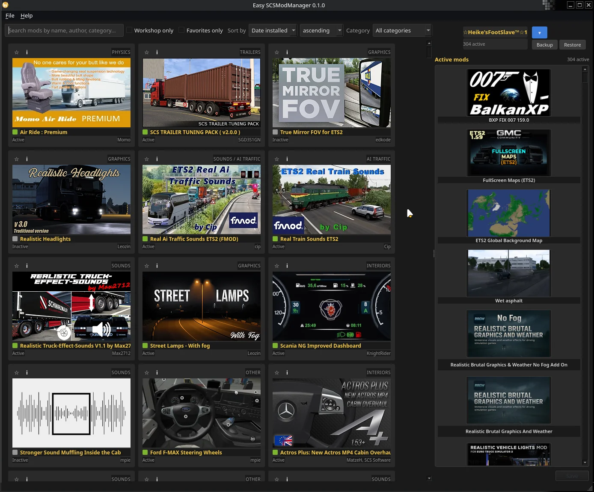

<p align="center">
  <picture>
    <source media="(prefers-color-scheme: dark)" srcset="easy_scsmodmanager/resources/images/readme_header_dark.webp">
    <source media="(prefers-color-scheme: light)" srcset="easy_scsmodmanager/resources/images/readme_header_light.webp">
    
  </picture>
</p>

<h1 align="center">🚚 Easy SCSModManager</h1>

[](https://www.python.org/)
[](https://www.python.org/)
[](https://www.scssoft.com/)
[](https://github.com/Switch-Bros/easy-scsmodmanager/blob/main/LICENSE)
[](https://github.com/Switch-Bros/easy-scsmodmanager)
[](https://github.com/Switch-Bros/easy-scsmodmanager)
[](https://deepwiki.com/Switch-Bros/easy-scsmodmanager)
[](https://github.com/Switch-Bros/easy-scsmodmanager/releases)

> **A proper mod manager for Euro Truck Simulator 2 and American Truck Simulator.**
> Browse your mods like the in-game manager, sort the load order with real drag and drop, and save it straight back to your profile - with the comfort features the game itself never had.

<p align="center">
  <a href="README_DE.md">
    
  </a>
</p>

<!-- Hero Screenshot -->
<p align="center">
  
</p>


<h3 align="center">💛 Support This Project</h3>

If this manager saves you from clicking a 300-mod list into shape one row at a time, PLEASE consider supporting its development. Every contribution - no matter how small - helps keep the project alive.

<p align="center">
  <a href="https://www.paypal.com/donate/?hosted_button_id=HWPG6YAGXAWJJ">
    
  </a>
  &nbsp;&nbsp;&nbsp;&nbsp;&nbsp;
  <a href="https://ko-fi.com/S6S51T9G3Y">
    
  </a>
</p>

<p align="center"><i>Thank you to everyone who has already contributed - you're amazing! 🙏</i></p>

<p align="center">Not in a position to donate? <b>A ⭐ on this repo helps just as much</b> - it makes the project visible to other truckers, and it's free.</p>

<p align="center">
  <picture>
    <source media="(prefers-color-scheme: dark)" srcset="easy_scsmodmanager/resources/images/readme_divider_dark.webp">
    <source media="(prefers-color-scheme: light)" srcset="easy_scsmodmanager/resources/images/readme_divider_light.webp">
    
  </picture>
</p>


<h2 align="center">✨ Features</h2>

<h3 align="center">🚚 Browse Every Mod You Own - <i>Even the Awkward Ones</i></h3>

Easy SCSModManager reads your local `mod/` folder and your Steam Workshop subscriptions for both ETS2 and ATS, and shows them in a card grid that looks like the in-game manager - just better.

- **Every container format** - plain `.scs`, ZIP-based `.scs`, HashFS v1 and v2 (decoded with a pure-Python reader, no external tools), and unpacked mod folders
- **Reads the mods the in-game browser shows** - name, icon and description straight from each mod's `manifest.sii`, so a workshop mod called `universal.scs` still shows its real name
- **Workshop previews** - when a mod has no readable local icon, the Steam Workshop preview image fills in
- **Search, sort and filter** - full-text search across name, author and category, sort by name or install date, filter by category, workshop-only or favourites-only
- **Multi-select** with Ctrl / Shift (or Ctrl+A for everything visible) to activate, deactivate or delete whole batches at once
- **Delete mods to the trash** - right-click (or press Del) to remove local mods, with a warning if a saved profile still uses them; Workshop mods stay managed by Steam
- **Filter by source** - show all mods, only Workshop, or only your local ones
- **Responsive grid** - maximise the window and the grid adds columns to fill the width instead of leaving an empty strip; the cards keep their size
- **BVB-yellow accent** - the refined dark theme paints mod names in Borussia Dortmund yellow

<p align="center">
  <picture>
    <source media="(prefers-color-scheme: dark)" srcset="easy_scsmodmanager/resources/images/readme_divider_dark.webp">
    <source media="(prefers-color-scheme: light)" srcset="easy_scsmodmanager/resources/images/readme_divider_light.webp">
    
  </picture>
</p>

<h3 align="center">🖱️ Drag and Drop Load Order - <i>The Whole Reason This Exists</i></h3>

The in-game mod manager only lets you nudge a mod up or down one row at a time. With 300 mods, getting one into the middle of the list means clicking *Move up* 150 times. Easy SCSModManager replaces that with a real drag and drop: scroll to the spot, drop the mod in, done.

- **Drag between panels** - pull mods from the library into the active list and back
- **Reorder by dragging** - rearrange the active load order directly, with smooth auto-scroll and a clear drop indicator
- **Grouped by load-order section** - the active list is split into load-order groups (financial, sound, trucks, trailers, maps, and so on) with clear headers, so a mod lands near the others of its kind
- **Out-of-place markers** - a mod that sits in the wrong group is flagged, with a right-click *Move to* to pin it where it belongs
- **Move whole selections to a group** - the *Move to* menu acts on every selected mod at once, plus an *Automatic* entry to send them back to their natural group; dragging a mod into a section keeps it there too
- **Writes straight to `profile.sii`** - your order is saved into the profile in plain text (the format the game reads without a signature check), so ETS2/ATS starts with exactly the order you set

<p align="center">
  <picture>
    <source media="(prefers-color-scheme: dark)" srcset="easy_scsmodmanager/resources/images/readme_divider_dark.webp">
    <source media="(prefers-color-scheme: light)" srcset="easy_scsmodmanager/resources/images/readme_divider_light.webp">
    
  </picture>
</p>

<h3 align="center">🗺️ Map Combos - <i>Share a Setup, Not a Screenshot</i></h3>

Map combo authors usually pass their load order around as a screenshot or a typed list that everyone then re-clicks by hand. Easy SCSModManager turns that into a file. **Right-click the Maps group header** in the active list to export or import a combo.

- **Export** the map block of your load order to a small JSON file and share it
- **Import** a combo and the app rescans first, then sets your maps into the exact order the author used - your trucks, sounds and everything else stay untouched
- **Missing-map check** - if the combo needs a map you don't have, a dialog lists exactly which ones, by name, so you know what to grab before you play
- **Update hint** - if you have a map but the combo was built with a newer version (you have RusMap 2.2, the combo used 2.4), it tells you - as a hint, never a block

<p align="center">
  <picture>
    <source media="(prefers-color-scheme: dark)" srcset="easy_scsmodmanager/resources/images/readme_divider_dark.webp">
    <source media="(prefers-color-scheme: light)" srcset="easy_scsmodmanager/resources/images/readme_divider_light.webp">
    
  </picture>
</p>

<h3 align="center">⚠️ Compatibility and Conflicts - <i>Spot Trouble Before the Game Crashes</i></h3>

- **Compatibility check** - mods are checked against the detected game version exactly the way the game does it: only a mod whose `manifest.sii` actually declares an incompatible version is flagged. A mod with no version info is never wrongly marked, so the 1.58 mod you run on purpose on 1.59 is left alone
- **Conflict severity at a glance** - when two active mods overwrite the same `def/` file, the higher one wins. Each affected mod is graded: a **yellow ⚠ triangle** when it loses *some* of its files (partly overwritten), a **red ⊘ crossed circle** when it loses *all* of them (fully overwritten - it does nothing where it sits), and no mark when it wins everything. The two shapes stay distinct in greyscale, so it reads without relying on colour
- **Full conflict tooltip + legend** - hover a flagged mod for every overwritten file and which mod wins it; a one-line legend appears under the active list while a conflict exists. It's a hint, not a block - for maps an overlap is often intentional
- **Generic-override filtering** - files that nearly every map touches are filtered out so the real conflicts don't drown in noise

<p align="center">
  <picture>
    <source media="(prefers-color-scheme: dark)" srcset="easy_scsmodmanager/resources/images/readme_divider_dark.webp">
    <source media="(prefers-color-scheme: light)" srcset="easy_scsmodmanager/resources/images/readme_divider_light.webp">
    
  </picture>
</p>

<h3 align="center">🎮 Both Games, One Window - <i>ETS2 and ATS Side by Side</i></h3>

- **Game switcher** - flip between Euro Truck Simulator 2 and American Truck Simulator from a single window; only installed games are selectable, and your choice is remembered for next launch
- **Auto-detection** - finds your install and profiles automatically on Linux (native and Proton) and Windows, or set the paths yourself in Settings
- **Favourites** - star the mods you reuse and filter to favourites only
- **Profile manager** - switch between your profiles and see which mods each one uses
- **Backup and restore** - every save can take a backup first, and any earlier profile is one click away from being restored

<p align="center">
  <picture>
    <source media="(prefers-color-scheme: dark)" srcset="easy_scsmodmanager/resources/images/readme_divider_dark.webp">
    <source media="(prefers-color-scheme: light)" srcset="easy_scsmodmanager/resources/images/readme_divider_light.webp">
    
  </picture>
</p>

<h3 align="center">🌍 Bilingual and Native - <i>Built for Linux and Windows</i></h3>

Full **English 🇬🇧** and **German 🇩🇪** interface with complete i18n - no hardcoded strings. Built with **PyQt6** and the bundled Inter font, so it looks the same everywhere.

- **Linux and Windows** from day one - native and Proton installs are both detected
- **Steam Deck friendly** - works in Desktop Mode
- **Six distribution formats** - AppImage, Windows EXE, .deb, .rpm, tar.gz and AUR


<h2 align="center">📦 Download & Install</h2>

| Format | Download | Notes |
|--------|----------|-------|
| 🐧 **AppImage** | [Download latest](https://github.com/Switch-Bros/easy-scsmodmanager/releases) | Works on any distro - download, chmod +x, run |
| 🪟 **Windows EXE** | [Download latest](https://github.com/Switch-Bros/easy-scsmodmanager/releases) | Standalone, no Python install needed |
| 🏗️ **AUR** | `yay -S easy-scsmodmanager` | Arch / Manjaro / CachyOS / EndeavourOS |
| 🍥 **.deb** | [Download latest](https://github.com/Switch-Bros/easy-scsmodmanager/releases) | Debian / Ubuntu / Linux Mint (uses system PyQt6) |
| 🎩 **.rpm** | [Download latest](https://github.com/Switch-Bros/easy-scsmodmanager/releases) | Fedora / openSUSE / RHEL (uses system PyQt6) |
| 📁 **tar.gz** | [Download latest](https://github.com/Switch-Bros/easy-scsmodmanager/releases) | Portable with install script |

<details>
<summary>🔧 Build from source (for developers)</summary>

```bash
# Clone
git clone https://github.com/Switch-Bros/easy-scsmodmanager.git
cd easy-scsmodmanager

# Virtual environment
python3 -m venv .venv
source .venv/bin/activate

# Install (editable) and run
pip install -e .
python -m easy_scsmodmanager
```

Requires **Python 3.13+** and **PyQt6**.

</details>


<h2 align="center">🗺️ Roadmap</h2>

| Milestone | Status |
|-----------|--------|
| SCS readers (ZIP, HashFS v1/v2, fake-lock, AEM), SII parser, scan cache | ✅ Complete |
| Mod browser, search/filter, profile header, i18n, settings | ✅ Complete |
| Drag and drop, load-order reorder, `profile.sii` writer, backups | ✅ Complete |
| Load-order groups, map-base pinning, out-of-place markers | ✅ Complete |
| Map Combo export/import with missing-map and version hints | ✅ Complete |
| Compatibility check (4 states) and def-overlap conflict hints | ✅ Complete |
| Favourites, ETS2/ATS game switcher | ✅ Complete |
| Multi-format packaging (AppImage, EXE, .deb, .rpm, tar.gz, AUR) | ✅ Complete |
| **v1.1.1 - First public release** | ✅ **Released** |
| Mod presets / shareable load-order profiles | 📋 Planned |
| Workshop update notifications and one-click Workshop links | 📋 Planned |
| Flatpak (Flathub submission) | 📋 Planned |


<h2 align="center">🌍 Translations</h2>

Easy SCSModManager ships with **English** and **German**. Want it in your language?

**Contributing a translation needs no coding.**

1. Copy the folder `easy_scsmodmanager/resources/i18n/en/` to `easy_scsmodmanager/resources/i18n/<your-code>/` (e.g. `ru/`)
2. Translate the values - never change the keys
3. Keep placeholders like `{count}` and `{name}` untouched
4. Check `easy_scsmodmanager/resources/i18n/languages.json`: if your language code has no entry yet, add one line with its code and its name in the language itself
5. Submit a Pull Request

A missing key shows up as the raw key in the interface, so gaps are easy to spot while you work.

<details>
<summary>🧪 Test your translation before the PR (optional, no coding either)</summary>

The app picks up any language folder automatically - you only need to run it from source once:

```bash
# Get the source: green "Code" button on GitHub -> Download ZIP -> unpack
# (or: git clone https://github.com/Switch-Bros/easy-scsmodmanager.git)

# In the unpacked folder:
python -m venv .venv
source .venv/bin/activate        # Windows: .venv\Scripts\activate
pip install -e .

# Put your translation at easy_scsmodmanager/resources/i18n/<your-code>/main.json, then:
python -m easy_scsmodmanager
```

Your language appears under **Settings -> Language**; pick it and restart the app. Any text that still shows as a raw key like `menu.file.refresh` is a key you have not translated yet.

Requires **Python 3.13+** (from [python.org](https://www.python.org/), on Windows tick "Add python.exe to PATH" in the installer).

</details>


<h2 align="center">🤝 Contributing</h2>

- 🐛 **Found a bug?** -> [Open an Issue](https://github.com/Switch-Bros/easy-scsmodmanager/issues)
- 💡 **Have an idea?** -> [Start a Discussion](https://github.com/Switch-Bros/easy-scsmodmanager/discussions)
- 🌍 **Speak another language?** -> [Help translate!](#-translations)
- 🔧 **Want to code?** -> Read the [Contributing guide](CONTRIBUTING.md), fork the repo, check the issues, and submit a PR
- 📖 **New here?** -> Browse the docs: [User Manual](docs/en/USER_MANUAL.md) · [FAQ](docs/en/FAQ.md) · [Keyboard Shortcuts](docs/en/KEYBOARD_SHORTCUTS.md) · [Tips & Tricks](docs/en/TIPS_AND_TRICKS.md) (also under **Help -> Documentation** in the app)

By taking part you agree to our [Code of Conduct](CODE_OF_CONDUCT.md).


<h2 align="center">⚖️ Legal Notice</h2>

This software is provided **"AS IS"**, without warranty of any kind, express or implied.

Easy SCSModManager edits only your own `profile.sii` and reads your own installed mods. It is **not affiliated with, endorsed by, or associated with SCS Software** or Valve Corporation. Euro Truck Simulator 2 and American Truck Simulator are trademarks of SCS Software.


<h2 align="center">📜 License</h2>

<p align="center">
  <a href="LICENSE">GPL-3.0-or-later</a> - Copyright © 2026 Switch Bros.
</p>

<p align="center">
  <picture>
    <source media="(prefers-color-scheme: dark)" srcset="easy_scsmodmanager/resources/images/readme_footer_dark.webp">
    <source media="(prefers-color-scheme: light)" srcset="easy_scsmodmanager/resources/images/readme_footer_light.webp">
    
  </picture>
</p>

<p align="center">
  Made with ❤️ on Linux by <a href="https://github.com/Switch-Bros">Switch Bros</a>
</p>
